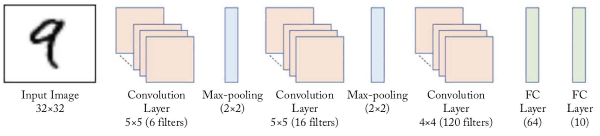

## LeNet Implementation
This repository is about LeNet in Tensorflow 2.  
I used tf.keras.Model and tf.layers.Layer instead of tf.keras.models.Sequential.  
This allows us to customize and have full control of the model.  
I also used custom training instead of relying on the fit() function.  
In case we have very huge dataset, I applied online loading (by batch) instead of loading the data completely at the beginning. This will eventually not consume the memory.  
However, in case you prefer tf.keras.models.Sequential based models and loading the data completely in the beginning, then please refer to my repository: [LeNet](https://github.com/Bao-Jiarong/LeNet)

### LeNet Architecrure
<p></p>
<center>

</center>

image is taken from [source](https://tianhaoo.github.io/2019/05/22/LeNet-5%E8%AF%86%E5%88%AB%E6%89%8B%E5%86%99%E6%95%B0%E5%AD%97/)   

<center>   
   
</center>

image is taken from [source](https://neurohive.io/en/popular-networks/vgg16/)   

### Training on MNIST
<p></p>
<center>

</center>

### Requirement
```
python==3.7.0
numpy==1.18.1
```
### How to use
Training & Prediction can be run as follows:    
`python train.py train`  
`python train.py predict img.png`  


### More information
* Please refer to the original paper of LeNet [here](http://yann.lecun.com/exdb/publis/pdf/lecun-01a.pdf) for more information.

### Implementation Note
* LeNet used 'relu' as activate function, and MaxPool2D for pooling.
* LeNet_5 used 'tanh' as activate function, and AveragePooling2D for pooling.

### Result for MNIST:   
* Learning rate = 0.001  
* Batch size = 32  
* Optimizer = Adam   

Name |  epochs  | Training Accuracy |  Validation Accuracy  |
:---: | :---: | :---: | :---:
LeNet_5 | 2 |  96.54% | 96.64%
LeNet_5 | 10 |  98.82% | 98.30%
